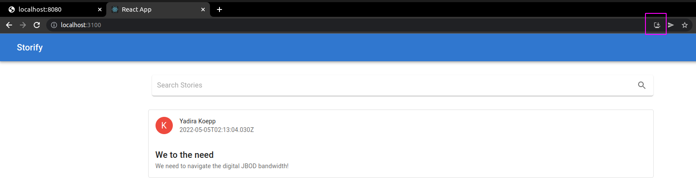
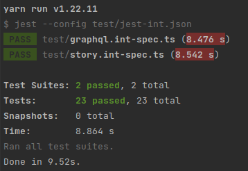

# Modern Web Development Technologies and Approaches

This project demonstrates usage of modern web technologies to implement a decoupled web application prototype.
It is divided into the following components:

* Nest.js server
* React PWA that consumes REST API
* React PWA that consumes GraphQL API
* Prisma tools for initializing a database

In order to demonstrate the usage of both REST and GraphQL, the server implementation exposes both REST and GraphQL API. 

## Prerequisites

* Docker 20.10.14+

For running the commands from `package.json` files manually (e.g. for tests):
* NPM 8.5.5+
* yarn 1.22.11 (optional but recommended)

### Docker and Docker Compose Setup on Ubuntu

Follow the installation guide in order to install Docker and docker-compose on Ubuntu:
* https://docs.docker.com/engine/install/ubuntu

### Docker and Docker Compose Setup on Windows

1. In order to run Docker on Windows, make sure you have Windows Subsystem For Linux 2 (WSL 2) installed and activated.
   * https://docs.microsoft.com/cs-cz/windows/wsl/install-manual
2. Install Docker Desktop for Windows.
   * Docker Desktop runs on top of the WSL and automatically installs command line tools for Docker, including docker-compose
   * The installed tools can be used in Windows Powershell

## Directory Structure

    images/                     images documenting some aspects of the implementations
    postman/                    contains Postman collection for both REST and GraphQL APIs 
    src/                        implementation source code
        client-side-graphql/        client implementation that consumes GraphQL API
        client-side-rest/           client implementation that consumes REST API
        postgres/                   directory for internal use by PostgreSQL service
        prisma-tools/               tools for database initialization
        server-side/                server implementation that exposes both REST and GraphQL APIs

## Run All Services

All the following commands must be run inside the `src/` directory.  
The build command can take up to **15 minutes** to complete.

Production mode:

```bash
docker-compose -f docker-compose.prod.yml build
docker-compose -f docker-compose.prod.yml up
```

Development mode (not intended for project presentation):

```bash
docker-compose -f docker-compose.dev.yml build
docker-compose -f docker-compose.dev.yml up
```

## Docker Services

Docker-compose starts the services listed in the table below.  
After successful startup, each of the services is accessible on `localhost:<outer_port>`

| Service                 | Outer Port | Inner Port |
|-------------------------|------------|------------|
| mwd-postgres            | 5438       | 5432       |     
| mwd-prisma-db-init*     |            |            |
| mwd-prisma-studio*      | 5555       | 5555       | 
| mwd-server-side         | 8080       | 3000       |
| mwd-client-side-rest    | 3100       | 3010       |
| mwd-client-side-graphql | 3200       | 3020       | 

* `mwd-prisma-db-init`: this service starts, performs database initialization and shuts down
* `mwd-prisma-studio`: this service starts only in the development mode

## PWA Clients

In production environment (composed by `docker-compose.prod.yml`), the client applications should be installable as follows.



## Sign-In Process

In order to log into the client applications, you need to enter any email-password pair from the `prisma-tools/prisma/data/users.json` file.

Note that we seed the database using the passwordHash field hashed by `argon2` instead of password field.

## Run Tests

In order to run tests, run `yarn` or `npm install` in the corresponding directory first.

Inside the `server-side/` directory, you can run the following commands:
* `yarn test` or `npm run test` in order to run unit tests
* `yarn test:int` or `npm run test:int` in order to run integraion tests

Inside the `client-side-rest/` directory, you can run the following commands:
* `yarn test` or `npm run test` in order to run unit tests

Tests should end up successful as the following screenshot depicts.



## REST API Documentation

REST API exposed by the server is documented using Swagger.  
The documentations is available under the `/api` route.

## Postman Collection

TODO

## Docker Commands

Remove all containers:
```bash
docker rm -vf $(docker ps -a -q)
```

Remove all images:
```bash
docker rmi -f $(docker images -a -q)
```

## Prisma Tools Commands

If needed, these command can be run inside the `prisma-tools/` directory.

Reset database schema and seed the database:

```bash
yarn prisma:up
```

Regenerate the content of `prisma/data/` directory:

```bash
yarn data:generate
```

